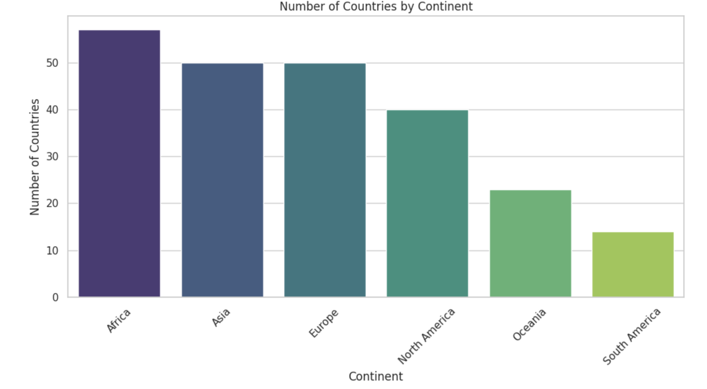
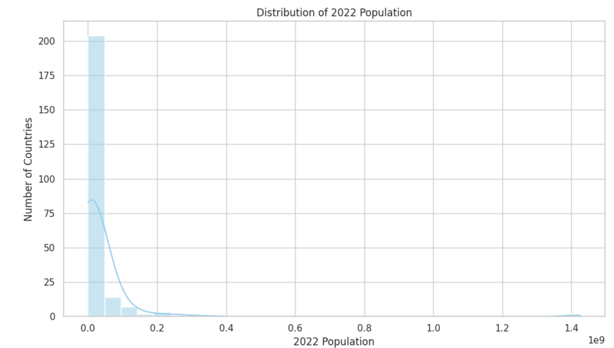
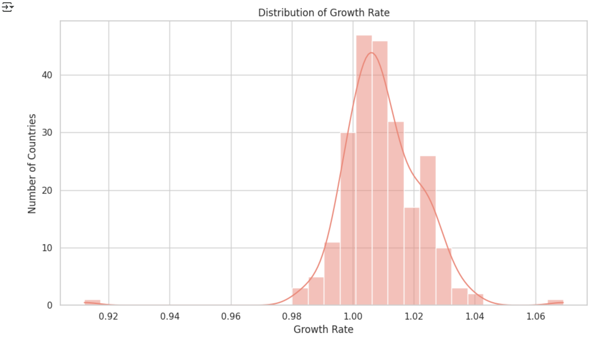
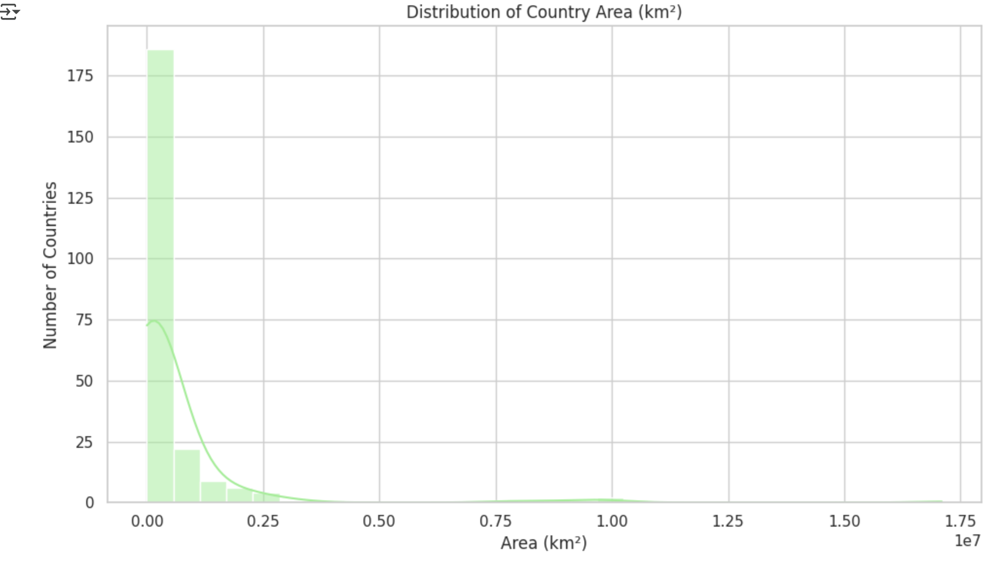

# 🌍 SCT_DS_01 - World Population Visualization Project

Welcome to **SCT_DS_01**, a data visualization project built as part of my internship at **Prodigy InfoTech (Data Science Domain)**.

This task focuses on using Python to visualize a real-world dataset: **World Population** by country. It involves plotting **bar charts** and **histograms** to extract and communicate insightful patterns.

---

## 📁 Project Structure

SCT_DS_01/
├── world_population.csv # Dataset used for analysis
├── SCT_DS_01.ipynb # Jupyter Notebook with all Python code
├── README.md # Project documentation
└── screenshots/ # Output visualizations
├── bar_chart.png
├── population_histogram.png
├── growth_rate_histogram.png
└── area_histogram.png

---

## 📊 Visualizations Performed

### 1. 📌 Bar Chart
- **X-axis:** Continents  
- **Y-axis:** Number of countries  
- **Insight:** Highlights how countries are distributed across continents

### 2. 📈 Histogram: 2022 Population
- Shows distribution of country populations
- Reveals population skewness and outliers

### 3. 📉 Histogram: Growth Rate
- Analyzes annual population growth rates
- Most countries hover near 1%

### 4. 📏 Histogram: Area (km²)
- Highlights variation in land sizes
- Shows how few countries have very large land areas

---

## 🛠️ Technologies Used

- `Python`
- `pandas`
- `matplotlib`
- `seaborn`
- `Jupyter Notebook`

---

## 📷 Sample Output

### Bar Chart - Countries by Continent  

### Histogram - 2022 Population  

### Histogram - Growth Rate  

### Histogram - Area (km²)  

---

## 📌 Key Learnings

- Data cleaning and analysis with **pandas**
- Visual encoding using **Seaborn & Matplotlib**
- Identifying meaningful patterns using charts
- Structuring and documenting a GitHub project professionally

---

## 📜 License

This project is licensed under the **MIT License**. See the [LICENSE](LICENSE) file for more details.

---

## 🙋‍♀️ Author

**Laasya Shree**  
[GitHub](https://github.com/Laasyashree) | [LinkedIn](https://www.linkedin.com/in/laasya-shree-aba412260)

---

